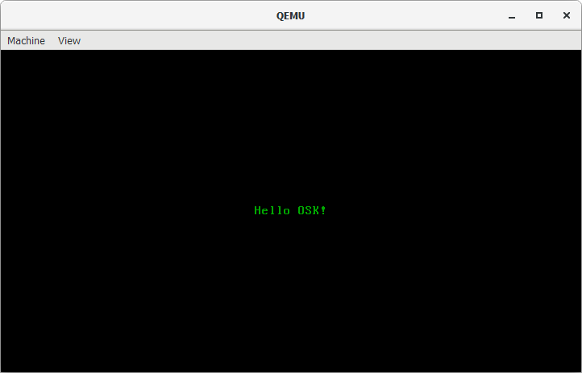

# osk #

*Operating System Kernel*

## Setup ##

- [Docker](https://www.docker.com/)
- [QEMU](https://www.qemu.org/) (*You should also add it's **PATH** to Environment Variables settings on Windows*)

## Docker ##

### Build Image ###

`./osk.sh -b` or:
  - `docker build ./ -t osk`

### Run Container ###

`./osk.sh -r` (and `.\run.bat` on *Windows* **CMD**) or:
  - `docker run --rm -it -d --name osk -v "%cd%":/root/env osk` on *Windows*
  - `docker run --rm -it -d --name osk -v "$pwd":/root/env osk` on *Linux*
  - `docker run --rm -it -d --name osk -v "$PWD":/root/env osk` on *MacOS*

### Build ISO Image (*within Docker's container*) ###

`make build-x86_64 && exit`

### Launch ISO Image ###

`./osk.sh -l` (and `.\launch.bat` on *Windows* **CMD**) or:
  - `qemu-system-x86_64 -L c:\\PROGRA~1\\qemu -cdrom .\\dist\\x86_64\\kernel.iso` on *Windows*
  - `qemu-system-x86_64 -L /usr/share/qemu/ -cdrom dist/x86_64/kernel.iso` on *Linux* and *MacOS*

### Kill Container ###

`./osk.sh -k` or:
  - `docker container kill osk`
